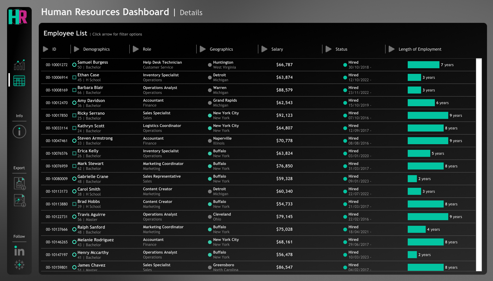
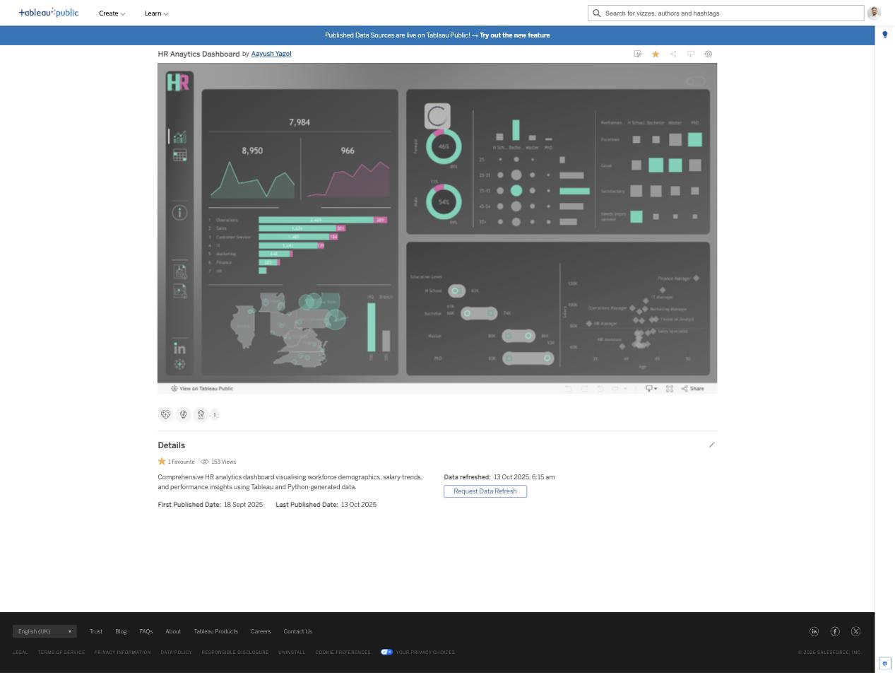
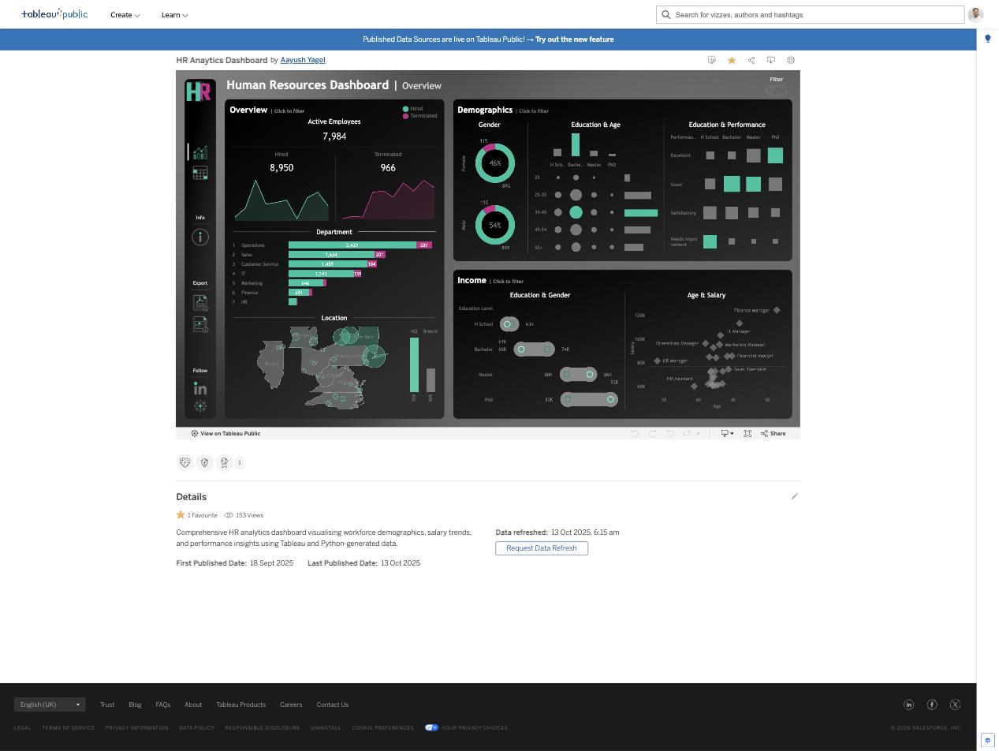

# HR Analytics Dashboard

An interactive HR analytics dashboard built in **Tableau Public**, giving a two-screen view of workforce composition, hiring/attrition trends, department distribution, location split, demographics, compensation, and individual employee records.

Live dashboard: [Tableau Public — HR Analytics Dashboard](https://public.tableau.com/app/profile/aayush.yagol/viz/HR-dashboard_17581424319570/HRsummary)

---

## Screen 1: Summary

The Summary screen is the main landing view, organised into three panels:

- **Overview** — Active employee count, hired vs. terminated trend lines, a department-level breakdown (headcount + terminations), and a US location map split by HQ vs. Branch.
- **Demographics** — Gender split, an Education x Age distribution grid, and an Education x Performance rating matrix.
- **Income** — Education x Gender salary bands (with adjustable range sliders) and an Age x Salary scatter plot labelled by job role.

## Screen 2: Details

Where the Summary screen answers "what does the workforce look like as a whole?", the Details screen answers "who, specifically?" It's a searchable, row-level **Employee List** that lets you drill from the aggregate numbers on the Summary screen down to individual records.

Each row shows:
- **ID** — employee number
- **Demographics** — name, age, and education level
- **Role** — job title and department
- **Geographics** — city and state
- **Salary** — compensation
- **Status** — hired/terminated, with hire date
- **Length of Employment** — tenure, shown as a horizontal bar for quick visual comparison across employees

Every column header carries its own expandable filter arrow, so the list can be sliced independently of (or in combination with) the global filters on the Summary screen — e.g. sorting by tenure to spot long-serving staff, or filtering by department and status to review a specific team's attrition.

## Key Features

- **Cross-filtering / highlight actions** — clicking any mark on the Summary screen (e.g. a department bar) dynamically highlights related data and dims everything else across all panels.

- **Global filter controls** — Gender, Status, Location, and Hire Date filters that can be toggled on to slice the entire Summary screen.

- **Interactive salary range sliders** — drag the Education-level income sliders to constrain the salary bands shown in the Age x Salary scatter plot.

## Tech Stack

- **Tableau Public / Desktop** for dashboard design, calculated fields, and dashboard actions
- Data source: **HumanResources** — a Tableau Hyper extract built from a HumanResources.csv dataset

## Data

The full dataset covers ~8,950 employee records across 7 departments (Operations, Sales, Customer Service, IT, Marketing, Finance, HR), with fields spanning demographics, education, performance ratings, compensation, hire/term dates, and location.

A 50-row sample is included at [`data/dataset_sample.csv`](data/dataset_sample.csv) to illustrate the record structure (Employee_ID, name, gender, state, city, education level, birthdate, hiredate, termdate, department, job title, salary, performance rating).

## Repository Contents

| Path | Description |
|---|---|
| `screenshots/` | Dashboard screenshots used in this README |
| `data/dataset_sample.csv` | 50-row sample of the underlying employee dataset |
| `README.md` | This file |

## Author

**Aayush Yagol**
- Portfolio: [aayushyagol.com](https://aayushyagol.com)
- Tableau Public: [public.tableau.com/app/profile/aayush.yagol](https://public.tableau.com/app/profile/aayush.yagol/vizzes)
- LinkedIn: [linkedin.com/in/aayush-yagol-046874145](https://linkedin.com/in/aayush-yagol-046874145/)
- GitHub: [@ayusyagol11](https://github.com/ayusyagol11)
